# JobNet — Premium Android Job Portal

JobNet is a professional, feature-rich Android application designed to bridge the gap between talented job seekers and top recruiters. Built natively in Java with a modern XML-based UI, JobNet delivers a seamless, high-performance experience with an elegant, dribbble-quality design system.

The platform offers two distinct user flows: a comprehensive **Job Seeker** portal for finding and tracking opportunities, and a powerful **Recruiter** dashboard for posting jobs and managing applicants.

---

## Key Capabilities & Features

### 👨‍💻 For Job Seekers
* **Smart Search & Filters:** Find the perfect role with real-time search and advanced filters (Full Time, Remote, Internship, etc.).
* **Detailed Job Listings:** View comprehensive job descriptions, salary brackets, required skills, and location details.
* **One-Tap Apply:** Streamlined application process with a beautifully animated progress tracker.
* **Saved Jobs:** Bookmark interesting opportunities to review and apply later.
* **Profile Management:** Showcase your skills, education, and experience with a dynamic profile dashboard featuring visual completion rings.
* **Application Tracking:** Monitor the status of your applications across the entire hiring pipeline (Applied → Reviewed → Interviewing).

### 🏢 For Recruiters
* **Recruiter Dashboard:** A dedicated hub to oversee all active job postings and recent applicant activity.
* **Job Management:** Easily post new jobs, edit existing listings, and manage application deadlines.
* **Applicant Tracking System (ATS):** Review applicant profiles, download resumes, and update candidate statuses in real-time.
* **Real-time Notifications:** Stay informed when new candidates apply to your job postings.
* **Company Profile:** Manage your employer brand and recruiter details.

---

## App in Action

### Job Seeker View

| Dashboard | Search & Filters | Saved Jobs | Profile & Stats |
| :---: | :---: | :---: | :---: |
| 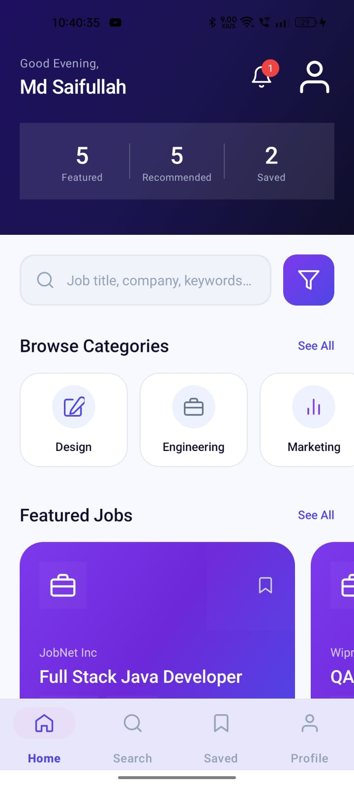 | 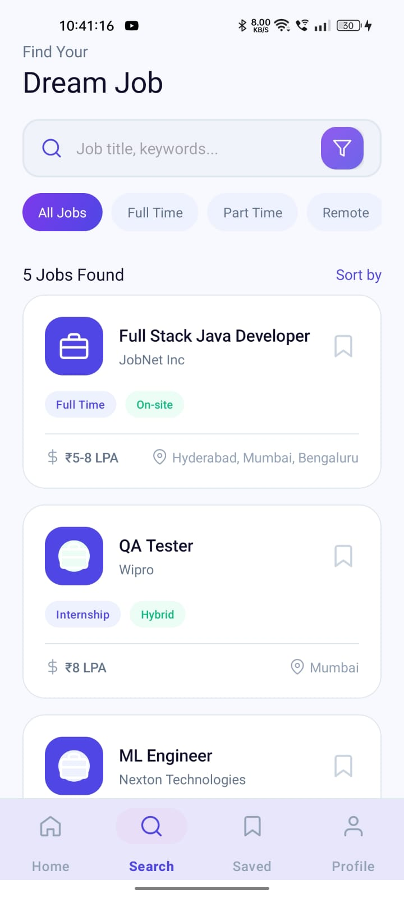 | 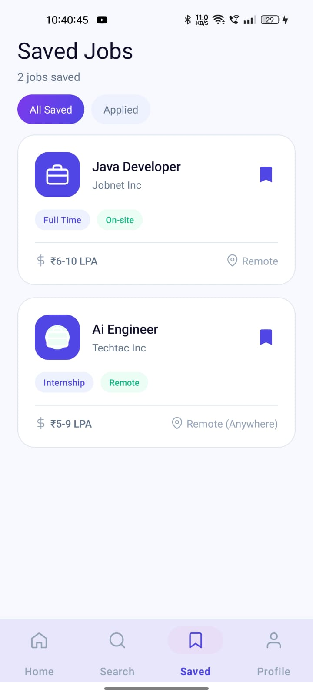 | 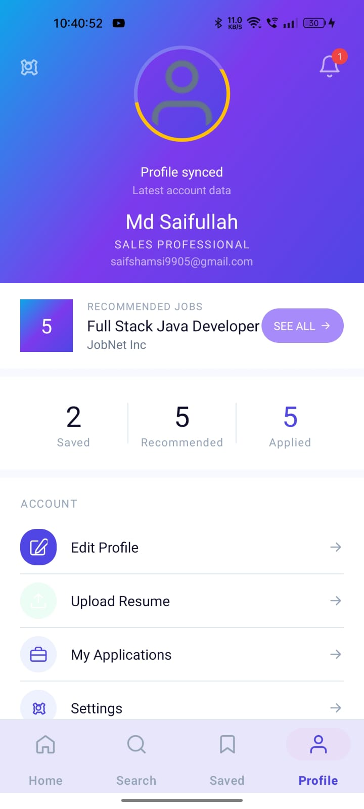 |

<br>

| My Applications | Application Progress | Job Details (1) | Job Details (2) |
| :---: | :---: | :---: | :---: |
| 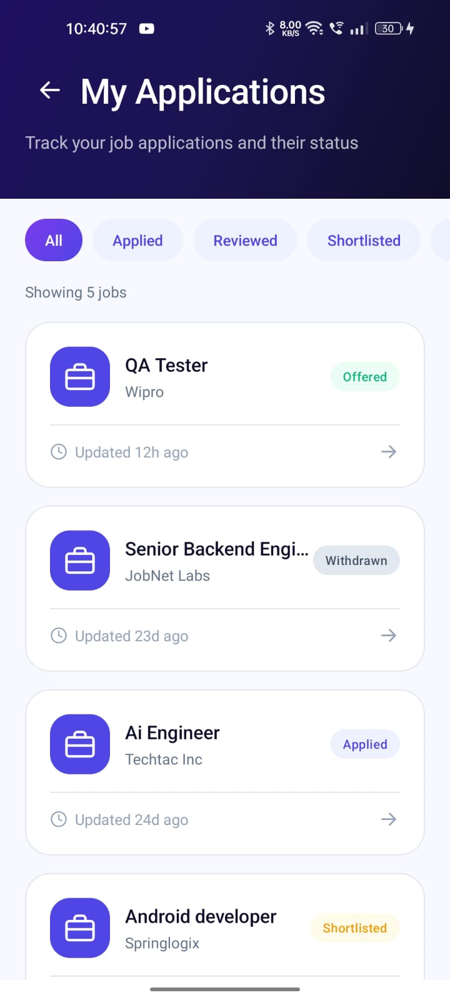 | 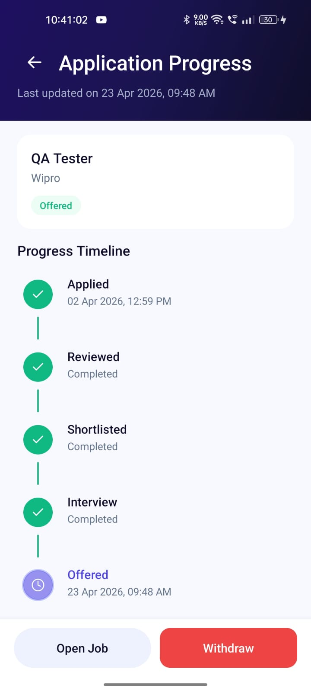 | 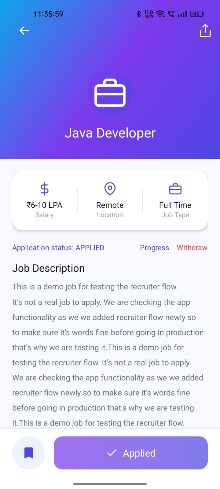 | 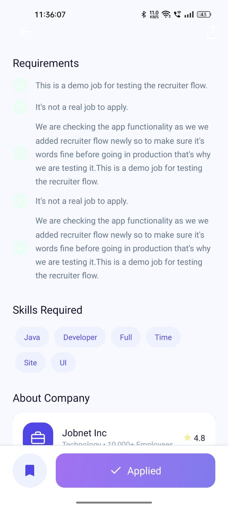 |

<br><br>

### Recruiter View

| Dashboard | Posted Jobs | Post New Job | Job Applicants |
| :---: | :---: | :---: | :---: |
| 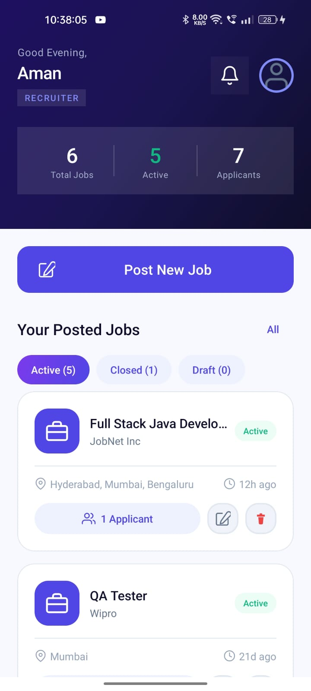 | 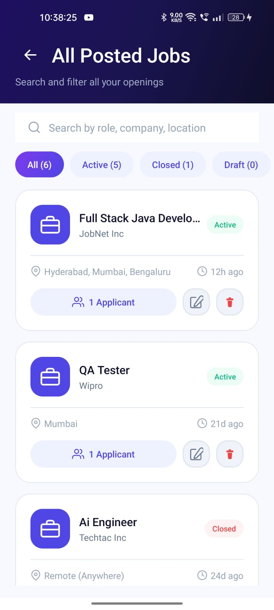 | 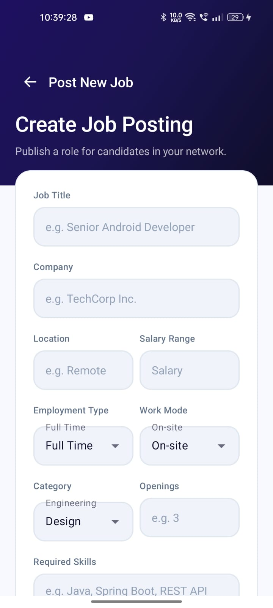 | 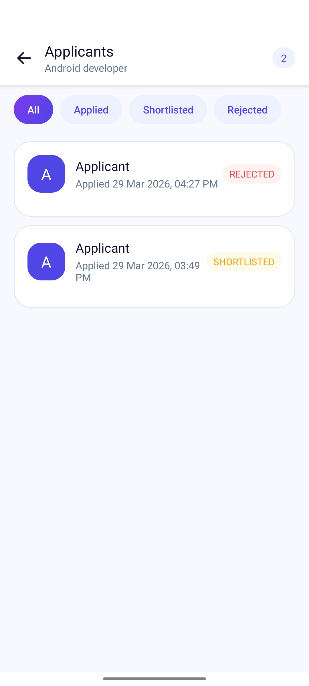 |

<br>

| Notifications | Recruiter Profile | Edit Job | Edit Profile |
| :---: | :---: | :---: | :---: |
| 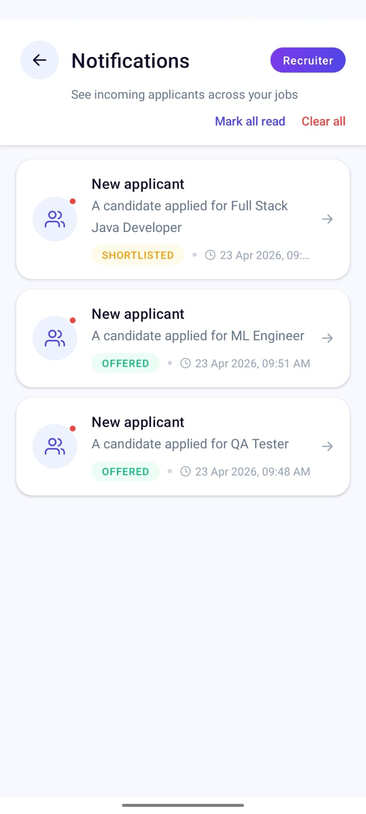 | 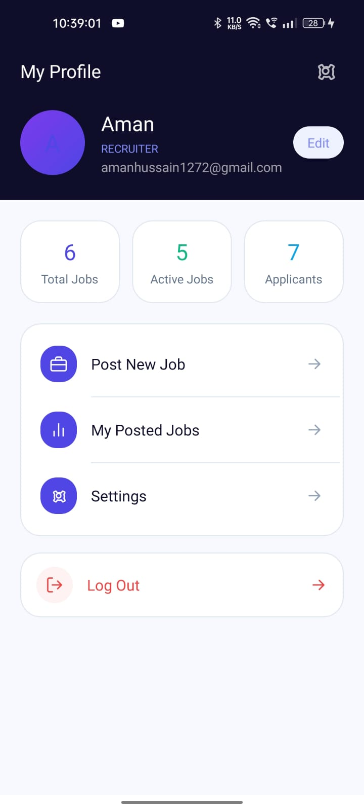 | 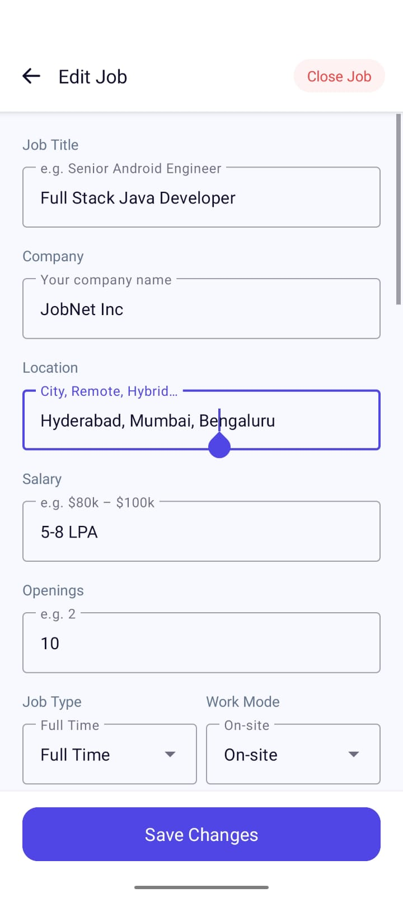 | 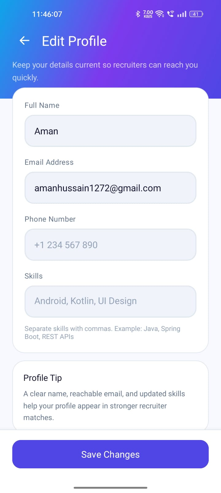 |

---

## Tech Stack & Architecture

JobNet is built using modern Android development practices, ensuring high performance, scalability, and maintainability.

* **Language:** Java
* **UI Design:** Native XML with Material Design Components
* **Architecture:** MVC/MVVM principles with robust Data Binding and Navigation Graph
* **Networking:** Retrofit / OkHttp (API Integration)
* **Image Loading:** Glide
* **Layout Management:** FlexboxLayout, CoordinatorLayout, ConstraintLayout
* **Local Storage:** SharedPreferences for session management

---

## Setup Instructions

### 1. Open in Android Studio
- Launch Android Studio and select **File → Open**.
- Navigate to and select the cloned `android/` folder.
- Android Studio will automatically sync the Gradle files and download required dependencies.

### 2. Configure API Endpoint (Optional)
If running against a live backend, ensure the base URL in your networking client is pointed to your active server IP/Domain.

### 3. Build & Run
- Recommended Minimum SDK: `minSdk 24` (Android 7.0 Nougat or higher).
- Target SDK: `targetSdk 34`.
- Click the **Run** button (Shift + F10) to deploy the app to an emulator or connected physical device.

---

## Core Dependencies

```groovy
implementation 'androidx.appcompat:appcompat:1.7.0'
implementation 'com.google.android.material:material:1.12.0'
implementation 'androidx.navigation:navigation-fragment:2.7.7'
implementation 'androidx.navigation:navigation-ui:2.7.7'
implementation 'androidx.cardview:cardview:1.0.0'
implementation 'com.google.android.flexbox:flexbox:3.0.0'
implementation 'androidx.coordinatorlayout:coordinatorlayout:1.2.0'
implementation 'com.github.bumptech.glide:glide:4.16.0'
```
